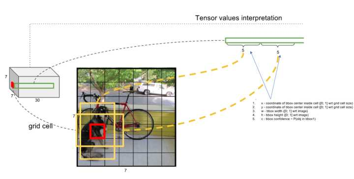
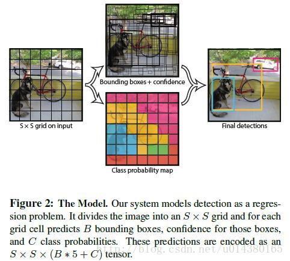

## 1.车辆检测 summary for YOLO

```
- Input image (608, 608, 3)
- The input image goes through a CNN, resulting in a (19,19,5,85) dimensional output. 
- After flattening the last two dimensions, the output is a volume of shape (19, 19, 425):
    - Each cell in a 19x19 grid over the input image gives 425 numbers. 
    - 425 = 5 x 85 because each cell contains predictions for 5 boxes, corresponding to 5 anchor boxes, as seen in lecture. 
    - 85 = 5 + 80 where 5 is because $(p_c, b_x, b_y, b_h, b_w)$ has 5 numbers, and and 80 is the number of classes we'd like to detect
- You then select only few boxes based on:
    - Score-thresholding: throw away boxes that have detected a class with a score less than the threshold
    - Non-max suppression: Compute the Intersection over Union and avoid selecting overlapping boxes
- This gives you YOLO's final output. 
```
**就是说原图形608×608×3的，会先经过一个ConvNet，然后变成比如19×19×(5×85)，5代表的anchor box，每个cell里（一共19×19个）有5个boxes。某个物体的中心落在这个网格中此网格就负责预测这个物体，形状的话通过anchor box来拟合【如下图一】 每个cell（红色边框）里有五个anchor box的形状，图中显示了两个（黄色边框）**





[图解YOLO - 链接详解](https://zhuanlan.zhihu.com/p/24916786?refer=xiaoleimlnote)
