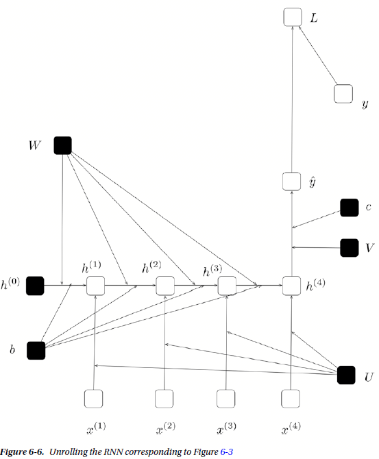
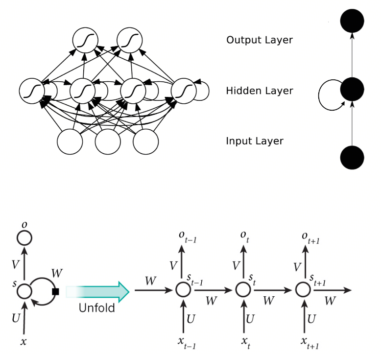

[1. **RNN Basics**](#rnn_basics)

[2. **Embedding Matrix**](#embedding_matrix)

[3. **transpose and gather**](#transpose_and_gather)

[4. **rnn size**](#rnn_size)

[5. **rnn loss function**](#rnn_loss_function)


## RNN_Basics

**常用的RNN有三种，LSTM、GRU、simpleRNN**

LSTM: can deal with gradient vanishing(not gradient explode)-memory and input are added-the influence never disappears unless forget gate is closed


这里以simpleRNN为例：

Let us start by describing the moving parts of a RNN. First, we introduce some notation.

 - 1. We will assume that input consists of a sequence of entities x<sup>(1)</sup>, x<sup>(2)</sup>, …, x<sup>(τ)</sup>.

 - 2. Corresponding to this input we either need to produce a sequence y<sup>(1)</sup>, y<sup>(2)</sup>, …, y<sup>(τ)</sup> 
or just one output for the entire input sequence y

 - 3. To distinguish between what the RNN produces and what it is ideally expected to produce we will denote by ˆy<sup>(1)</sup>,
ˆy<sup>(2)</sup>, …, ˆy<sup>(τ)</sup> or ˆy the output the RNN produces. Note that this is distinct from what the RNN should
ideally produce, which is denoted by y<sup>(1)</sup>, y<sup>(2)</sup>, …, y<sup>(τ)</sup> or y.
      
RNNs either produce an output for every entity in the input sequence or produce a single output for the entire sequence. Let us consider the case where an RNN produces one output for every entity in the input. The RNN can be described using the following equations:


   **h<sup>(t)</sup> = tanh(Ux<sup>(t)</sup> + Wh<sup>(t-1)</sup> + b)**

   **ˆy<sup>(t)</sup> = softmax(Vh<sup>(t)</sup> + c)**


The following points about the RNN equations should be noted:

 - 1. The RNN computation involves first computing the hidden state for an entity in the sequence. This is denoted by 
h<sup>(t)</sup>.

 - 2. The computation of h<sup>(t)</sup> uses the corresponding input at entity x<sup>(t)</sup> and the previous hidden 
state h<sup>(t-1)</sup>.

 - 3. The computation of h<sup>(t)</sup> is done for each entity in the input sequence x<sup>(1)</sup>, x<sup>(2)</sup>, …, x<sup>(τ)</sup>.

 - 4. The output ˆy<sup>(t)</sup> is computed using the hidden state h<sup>(t)</sup>.

 - 5. There are weights associated with the input and the previous hidden state while computing the current hidden state. 
This is denoted by U and W respectively. There is also a bias term denoted by b.

 - 6. There are weights associated with the hidden state while computing the output; this is denoted by V. There is also 
a bias term, which is denoted by c.

 - 7. The tanh activation function (introduced in earlier chapters) is used in the computation of the hidden state.

 - 8. The softmax activation function is used in the computation of the output.

 - 9. The RNN as described by the equations can process an arbitrarily large input sequence.

 - 10. The parameters of the RNN, namely, U,W,V,b,c, etc. are shared across the computation of the hidden layer and 
output value (for each of the entities in the sequence).



## Embedding_Matrix

**word2vec也叫word embeddings**

||Man(5391)|Woman(9853)|King(4914)|Queen(7157)|Apple(456)|Orange(6257)
|--|--|--|--|--|--|--
|Gender|-1|1|-0.95|0.97|0.00|0.01
|Royal|0.01|0.02|0.93|0.95|-0.01|0.00
|Age|0.03|0.02|0.70|0.69|0.03|-0.02
|Food|0.09|0.01|0.02|0.01|0.95|0.97

Embedding layer不是通过embedding matrix乘以一个单词的one-hot向量实现的因为这样又慢有复杂，而是直接在embedding matrix上找到那个单词

**那么这些词向量是怎么训练出来的呢？**<br>
word2vec有两种实现方式skip-gram和cbow模型，霍夫曼编码和负采样是对cbow和skip-gram的优化

#### 负采样<br>
训练一个神经网络意味着使用一个训练样本就要稍微调整一下所有的神经网络权重，这样才能够确保预测训练样本更加精确。换句话说，每个训练样本都会改变神经网络中的权重。

正如我们上面讨论的，单词表的大小意味着我们的skip-gram神经网络拥有非常庞大的权重数，所有权重都会被十亿个样本中的一个稍微地进行更新！

负采样通过使每一个训练样本仅仅改变一小部分的权重而不是所有权重，从而解决这个问题。下面介绍它是如何进行工作的。

当通过（”fox”, “quick”)词对来训练神经网络时，我们回想起这个神经网络的“标签”或者是“正确的输出”是一个one-hot向量。也就是说，对于神经网络中对应于”quick”这个单词的神经元对应为1，而其他上千个的输出神经元则对应为0。

使用负采样，我们通过随机选择一个较少数目（比如说5个）的“负”样本来更新对应的权重。(在这个条件下，“负”单词就是我们希望神经网络输出为0的神经元对应的单词）。并且我们仍然为我们的“正”单词更新对应的权重（也就是当前样本下”quick”对应的神经元）。

> 论文说选择5-20个单词对于较小的样本比较合适，而对于大样本，我们可以选择2-5个单词。

回想一下，我们模型的输出层有大约300 x 10,000维度的权重矩阵。所以我们只需要更新正确的输出单词”quick”的权重，加上额外的5个其他应该输出为0的单词的权重。也就是总共6个输出神经元，和总共1800个(每个单词300维)的权重值。这些总共仅仅是输出层中3百万个权重中的0.06%。

## transpose_and_gather

```python
# Get output of RNN sequence 评论预测多分类问题（下面的rnn_size也是一样）
output = tf.transpose(output, [1, 0, 2])
last = tf.gather(output, int(output.get_shape()[0]) - 1)
```
上面这个代码的意思先进行一个dimension的转换，然后一句话最后一个词那里进行输出，比如max_sequence_length=25那么第25个的时候（索引是24）进行输出y_，

## rnn_size

RNNs之所以称为循环神经网路，即一个序列当前的输出与前面的输出也有关。具体的表现形式为网络会对前面的信息进行记忆并应用于当前输出的计算中，即隐藏层之间的节点不再无连接而是有连接的，并且隐藏层的输入不仅包括输入层的输出还包括上一时刻隐藏层的输出。<br>
我目前的理解是比如rnn_size为10，max_sequence_length=25。理论上，RNNs能够对任何长度的序列数据进行处理。但是在实践中，为了降低复杂性往往假设当前的状态只与前面的10个状态相关，经过transpose输出的维度是(25,?,10),然后进行gather得到第25个词时的参数，维度为last = (?,10),然后进行最后的全连接进行softmax，具体公式是tf.matmul(last,weight)+bias,这里的weight维度(rnn_size,num_classes)，bias维度(num_classes,)

**典型RNN结构图**


## rnn_loss_function

tf.nn.sparse_softmax_cross_entropy_with_logits<br>
这个函数和tf.nn.softmax_cross_entropy_with_logits函数比较明显的区别在于它的参数labels的不同，这里的参数label是非稀疏表示的，比如表示一个3分类的一个样本的标签，稀疏表示的形式为[0,0,1]这个表示这个样本为第3个分类，而非稀疏表示就表示为2（因为从0开始算，0,1,2,就能表示三类），同理[0,1,0]就表示样本属于第二个分类，而其非稀疏表示为1。tf.nn.sparse_softmax_cross_entropy_with_logits（）比tf.nn.softmax_cross_entropy_with_logits多了一步将labels稀疏化的操作。因为深度学习中，图片一般是用非稀疏的标签的，所以用tf.nn.sparse_softmax_cross_entropy_with_logits（）的频率比tf.nn.softmax_cross_entropy_with_logits高。
