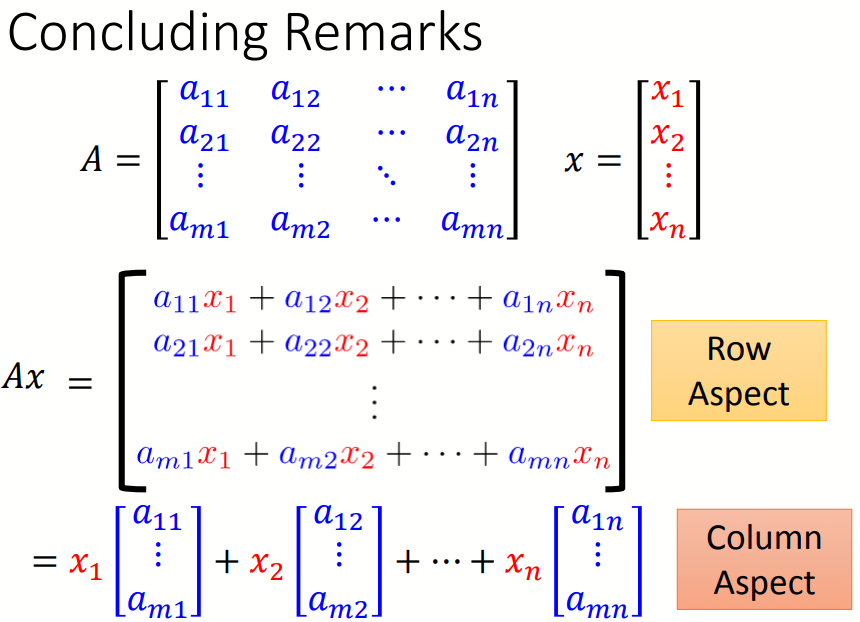
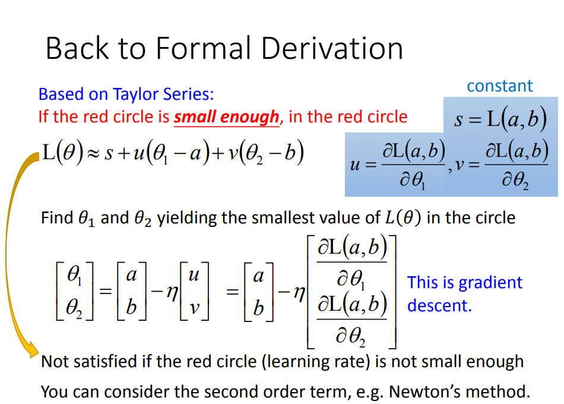

# 李宏毅课堂

## 李宏毅课堂之线性代数

**1.矩阵的特性**

1) A, B, C are mxn matrices, and s and t are scalars(相当于常量)  
• A + B = B + A  
• (A + B) + C = A + (B + C)  
• (st)A = s(tA)  
• s(A + B) = sA + sB  
• (s+t)A = sA + tA 

2) Let A and B be k x m matrices, C be an m x n matrix, and P and Q be n x p matrices  
• For any scalar s, s(AC) = (sA)C = A(sC)  
• (A + B)C = AC + BC  
• C(P+Q)=CP+CQ  
• IA = A = AI  
• The product of any matrix and a zero matrix is a zero matrix

3) determinants  
2x2 matrix A, det(A) = ad - bc  
det(AB) = det(A)det(B)  
det(A+B) != det(A) + det(B)   
det(A转置) =det(A)

4) basis  
A basis is the smallest generation set  
A basis is the largest independent set in the subspace.  
if S is independent --> S is basis  
if S is a generation set --> S is basis

**2. concluding remarks**

**3. consistent vs inconsistent**

• A system of linear equations is called consistent if it has one or more solutions.  
• A system of linear equations is called inconsistent if its solution set is empty. 

**4. gradient descent**

gradient descent有几个问题：  
stuck at local minimal  
stuck at saddle point  
very slow at the plateau  

**5. xx**
