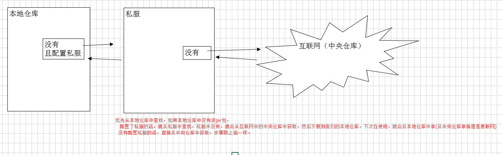
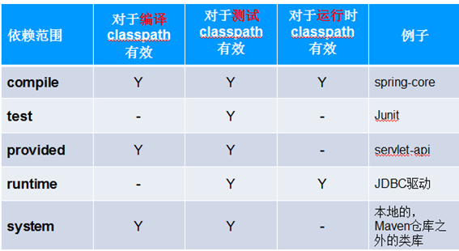

### 1. Maven是什么？
Maven是基于项目对象模型(POM project object model)，可以通过一小段描述信息（配置）来管理项目的构建，报告和文档的软件项目管理工具

我自己觉得，Maven的核心功能便是合理叙述项目间的依赖关系，通俗点讲，就是通过pom.xml文件的配置获取jar包，而不用手动去添加jar包，而这里pom.xml文件对于学了一点maven的人来说，就有些熟悉了，怎么通过pom.xml的配置就可以获取到jar包呢？pom.xml配置文件从何而来？等等类似问题我们需要搞清楚，如果需要使用pom.xml来获取jar包，那么首先该项目就必须为maven项目，maven项目可以这样去想，就是在java项目和web项目的上面包裹了一层maven，本质上java项目还是java项目，web项目还是web项目，但是包裹了maven之后，就可以使用maven提供的一些功能了(通过pom.xml添加jar包)。

groupId、artifactId、version三个属性就能定位一个jar包

### 2. 仓库的概念
仓库分为：本地仓库、第三方仓库(私服)、[中央仓库](http://mvnrepository.com/)

1). 本地仓库
Maven会将工程中依赖的构件(Jar包)从远程下载到本机一个目录下管理，每个电脑默认的仓库是在 $user.home/.m2/repository下
一般我们会修改本地仓库位置，自己创建一个文件夹，在从网上下载一个拥有相对完整的所有jar包的结合，都丢到本地仓库中，然后每次写项目，直接从本地仓库里拿就行了。
修改本地库位置：在$MAVEN_HOME/conf/setting.xml文件中修改 \<localRepository>new location\</localRepository>

2). 第三方仓库（私服）
第三方仓库，又称为内部中心仓库，也称为私服

私服：一般是由公司自己设立的，只为本公司内部共享使用。它既可以作为公司内部构件协作和存档，也可作为公用类库镜像缓存，减少在外部访问和下载的频率。（使用私服为了减少对中央仓库的访问
私服可以使用的是局域网，中央仓库必须使用外网
也就是一般公司都会创建这种第三方仓库，保证项目开发时，项目所需用的jar都从该仓库中拿，每个人的版本就都一样。
注意：连接私服，需要单独配置。如果没有配置私服，默认不使用

3). 中央仓库
Maven内置了远程公用仓库：http://repo1.maven.org/maven2

这个公共仓库是由Maven自己维护，里面有大量的常用类库，并包含了世界上大部分流行的开源项目构件。目前是以java为主
工程依赖的jar包如果本地仓库没有，默认从中央仓库下载

总结：获取jar包的过程


### 3. maven scala项目结构
```
simple
---pom.xml　　　　核心配置，项目根下
---src
 ---main　　　　　　
      ---java        java源码目录 
      ---resources　  配置文件目录
      ---scala　　　　scala源码目录
 ---test
   ---java　　　　 测试java源码目录
   ---resources　  测试配置目录
   ---scala       测试scala源码目录

```
### 4. 依赖(坐标)的常见配置
groupId、artifactId、version是依赖的基本坐标，缺一不可，这三个可以不用将，都知道，重要的是除了这三个之外的配置属性需要我们理解

scope：依赖范围，意思就是通过pom.xml加载进来的jar包，来什么范围内使用生效，范围包括编译时，运行时，测试时


### 5. pom.xml和setting.xml文件自己的理解

[**settings.xml示例**](settings.xml)

[setting.xml详解](https://www.cnblogs.com/yangxia-test/p/4409736.html)
```xml
<!-- 设置从这里开始 声明规范-->
<settings xmlns="http://maven.apache.org/SETTINGS/1.0.0"   
          xmlns:xsi="http://www.w3.org/2001/XMLSchema-instance"
          xsi:schemaLocation="http://maven.apache.org/SETTINGS/1.0.0 http://maven.apache.org/xsd/settings-1.0.0.xsd">
  ///设置本地maven仓库的地址
  <localRepository>D:\mvn_repo</localRepository>  
  <!-- 将maven包传到仓库上，设置用户名和密码 -->
  <servers>   
	<server>
	     <id>releases</id>
	     <username>xxx</username>
	     <password>xxx</password>
	</server>
	<server>
             <id>snapshots</id>
             <username>xxx</username>
             <password>xxx</password>
       </server>  
   </servers>
   <!-- 镜像，一般公司会创建一个仓库放依赖包 -->
   <mirrors>
      <mirror>
          <id>companyname_maven_repo</id>
          <mirrorOf>*</mirrorOf>
          <name>companyname maven server</name>
          <url>http://maven.companyname.com/content/groups/public</url>
      </mirror>
   </mirrors>
   <!--根据环境参数来调整构建配置的列表。settings.xml中的profile元素是pom.xml中profile元素的裁剪版本。它包含了id，activation, repositories,
pluginRepositories和 properties元素。这里的profile元素只包含这五个子元素是因为这里只关心构建系统这个整体（这正是settings.xml文件的角色定位），而
非单独的项目对象模型设置。如果一个settings中的profile被激活，它的值会覆盖任何其它定义在POM中或者profile.xml中的带有相同id的profile。 -->
   <profiles>
	<profile>
	    <id>dev</id>
	    <repositories>
		  <repository>
			<id>companyname_maven_repo</id>
			<url>http://maven.companyname.com/content/groups/public</url>
			<releases>
				<enabled>true</enabled>
			</releases>
			<snapshots>
				<enabled>true</enabled>
			</snapshots>
		  </repository>
	    </repositories>
	</profile>
  </profiles>
  <!--这里的profile可以是定义在settings.xml中的，也可以是定义在pom.xml中的。这个时候如果我们需要指定dev为激活状态，
       那么我们就可以在settings.xml中定义activeProfiles -->
  <activeProfiles>
    <activeProfile>dev</activeProfile>
  </activeProfiles>
</settings>
```
[**pom.xml示例**](pom.xml)

[pom.xml详解](http://blog.csdn.net/zhuxinhua/article/details/5788546)
```xml
<!-- 声明规范 -->
<?xml version="1.0" encoding="UTF-8"?>
<project xmlns="http://maven.apache.org/POM/4.0.0"
         xmlns:xsi="http://www.w3.org/2001/XMLSchema-instance"
         xsi:schemaLocation="http://maven.apache.org/POM/4.0.0 http://maven.apache.org/xsd/maven-4.0.0.xsd">
    <modelVersion>4.0.0</modelVersion>
    <!-- groupId, artifactId和version组成唯一标识 -->
    <groupId>com.binzhou.test</groupId>
    <artifactId>com.binzhou.test</artifactId>
    <version>0.0.1</version>
    <packaging>jar</packaging>
    <!-- 可以设置一些通用的后续还会用到的变量 -->
    <properties>
        <scala.version>2.11.8</scala.version>
        <spark.version>2.1.0</spark.version>
    </properties>
    <!-- 依赖包 这里provided的意思是编译打jar包的时候不打这个依赖进去，平台提交的时候已经有了的-->
    <dependencies>
        <dependency>
            <groupId>org.apache.spark</groupId>
            <artifactId>spark-sql_2.11</artifactId>
            <version>2.1.1</version>
            <scope>provided</scope>
        </dependency>
    </dependencies>
    <!-- 这个repositories和pluginRepositories都是要deploy到远程仓库的时候使用的，配合setting.xml中的用户名和密码 -->
    <repositories>
        <repository>
            <id>central</id>
            <!-- This should be at top, it makes maven try the central repo first and then others and hence faster deploy resolution -->
            <name>Maven Repository</name>
            <url>http://maven.companyname.com/content/repositories/releases/</url>
            <releases>
                <enabled>true</enabled>
            </releases>
            <snapshots>
                <enabled>true</enabled>
            </snapshots>
        </repository>
    </repositories>
    <pluginRepositories>
        <pluginRepository>
            <id>central</id>
            <url>http://maven.companyname.com/content/repositories/releases/</url>
            <releases>
                <enabled>true</enabled>
            </releases>
            <snapshots>
                <enabled>true</enabled>
            </snapshots>
        </pluginRepository>
    </pluginRepositories>

    <!-- 编译 构建scala项目 -->
    <build>
        <plugins>
	    <!-- maven项目的一些插件 -->
            <plugin>
                <groupId>org.codehaus.mojo</groupId>
                <artifactId>build-helper-maven-plugin</artifactId>
                <version>1.8</version>
                <executions>
                    <execution>
                        <id>add-source</id>
                        <phase>generate-sources</phase>
                        <goals>
                            <goal>add-source</goal>
                        </goals>
                        <configuration>
                            <sources>
                                <source>src/main/scala</source>
                                <source>src/test/scala</source>
                            </sources>
                        </configuration>
                    </execution>
                    <execution>
                        <id>add-test-source</id>
                        <phase>generate-sources</phase>
                        <goals>
                            <goal>add-test-source</goal>
                        </goals>
                        <configuration>
                            <sources>
                                <source>src/test/scala</source>
                            </sources>
                        </configuration>
                    </execution>
                </executions>
            </plugin>
            <plugin>
                <groupId>net.alchim31.maven</groupId>
                <artifactId>scala-maven-plugin</artifactId>
                <version>3.1.5</version>
                <executions> <execution>
                    <goals>
                        <goal>compile</goal>
                        <goal>testCompile</goal>
                    </goals> </execution>
                </executions>
                <configuration>
                    <scalaVersion>${scala.version}</scalaVersion>
                </configuration>
            </plugin> <plugin>
            <groupId>org.apache.maven.plugins</groupId>
            <artifactId>maven-compiler-plugin</artifactId>
            <configuration>
                <source>1.7</source>
                <target>1.7</target>
                <encoding>utf-8</encoding>
            </configuration>
            <executions>
                <execution>
                    <phase>compile</phase>
                    <goals>
                        <goal>compile</goal>
                    </goals>
                </execution>
            </executions>
        </plugin>
            <plugin>
                <artifactId>maven-assembly-plugin</artifactId>
                <configuration>
                    <descriptorRefs>
                        <descriptorRef>jar-with-dependencies</descriptorRef>
                    </descriptorRefs>
                    <archive>
                        <manifest>
                            <mainClass>com.binzhou.spark.ScalaWordCount</mainClass>
                        </manifest>
                    </archive>
                </configuration>
            </plugin>
        </plugins>
    </build>

</project>
```


