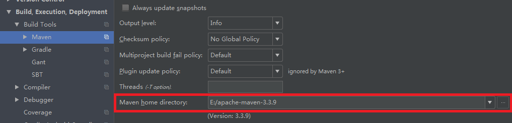
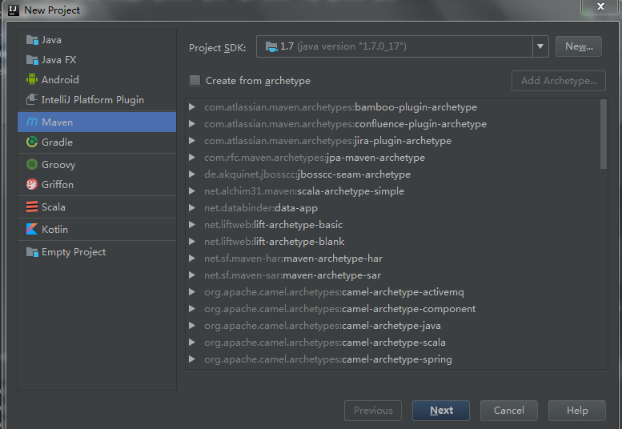
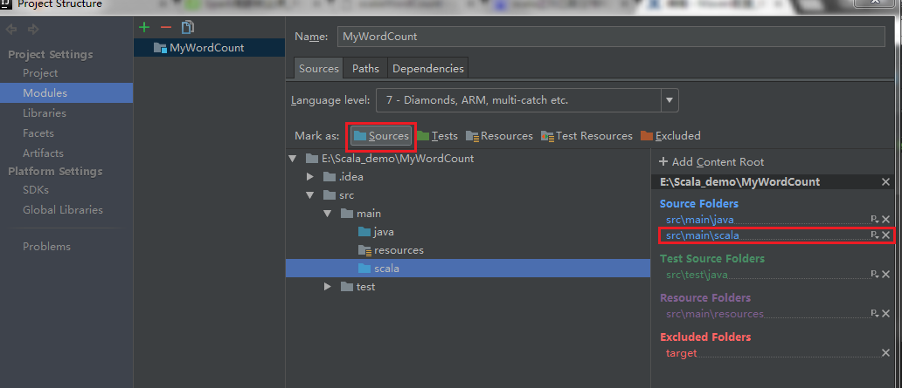

## Maven配置_编译打包Spark应用  windows版

[**1. 本地编译打包Spark应用准备：**] 

1.1 文本所介绍的本地编译都是在windows系统下完成的，首先需要确定电脑上已经安装好了JDK和Scala并且配置好了环境变量, 如果配置完成在cmd中输入java -version和scala -version

1.2 安装完了jdk和scala以后如果打开cmd输入以上命令如果可以显示以上信息则忽略此步，如果出现不是内部或外部命令的提示则需要设置环境变量。具体步骤是 右击【我的电脑】--【更改设置】--【高级】--【环境变量】–系统变量(S)下新建变量名JAVA_HOME,变量值C:\Program Files\Java\jdk1.7.0_17(默认安装路径)，然后在Path变量下添加;%JAVA_HOME%\bin;%JAVA_HOME%\jre\bin
系统变量下新建变量名SCALA_HOME，变量值C:\Program Files (x86)\scala，然后在Path变量下添加;C:\Program Files (x86)\scala\bin，保存并退出。这时cmd中输入命令就能显示了

[**2. 本地编译Intellij Idea + Maven(强烈推荐使用的组合)**] 

2.1 首先需要安装idea下载地址链接 https://www.jetbrains.com/idea/ 和 Maven3.3.9，安装idea到默认位置。
然后打开idea，在Configure--Plugins–Install plugins from disk导入预先下载的scala-intellij-bin-2016.3.5点击ok然后restart idea即可
然后把maven解压到方便的任意位置(我把解压文件放在E:/下)，并且配置好环境变量具体查看以上步骤在系统变量下新建变量名MVN，变量值E:\apache-maven-3.3.9，然后在Path变量下添加;E:\apache-maven-3.3.9\bin，保存并退出

2.2 打开idea进入Settings，搜索Maven，然后在Maven home directory改成解压maven的存放地址如下图所示：

[**3. 以上推荐使用的开发环境软件下载：**]

|软件|版本|下载地址
|--|--|--
|Java|最新jdk|[java](http://www.oracle.com/technetwork/java/javase/downloads/jdk8-downloads-2133151.html)
|Scala(for spark-2.0)|scala-2.11.8|[scala](http://www.scala-lang.org/download/2.11.8.html)
|Maven|最新|[maven](http://maven.apache.org/download.cgi)
|Intellij idea|最新community|[intellij](https://www.jetbrains.com/idea/)

[**4. 在idea中创建maven工程：**]

4.1 打开idea，选择【new project】选择sidebar中Maven后点击next

4.2 下一步中输入GroupId和ArtifactId和Version，点击next(示例com.binzhou.spark)

4.3 下一步输入project name，然后点击finish即可 注意进去以后要[**enable auto import!**]

4.4 创建完毕以后我们需要在main目录下新建一个 scala directory并且Source这个directory：
【File】–【Project Structure】--【Modules】选中scala文件夹并且source

4.5 修改setting.xml, pom.xml文件, 主要想把依赖包从其他仓库写入本地仓库

[settings.xml示例](settings.xml)

[pom.xml示例](pom.xml)

